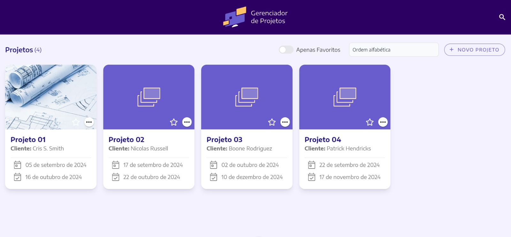

# Project Manager (Gerenciador de projetos)

**Project-Manajer** é um gerenciador de projetos desenvolvido com [Nuxt.js 3](https://nuxt.com/), [TypeScript](https://www.typescriptlang.org/) e  [Tailwind CSS](https://reactjs.org/). Ele permite cadastrar, visualizar, editar, excluir e filtrar projetos, com funcionalidades como ordenação alfabética, por data de início ou de finalização, além de um filtro para favoritos. O sistema inclui páginas para criação e edição de projetos, modal de confirmação de exclusão e opção de favoritar/desfavoritar.

## 🚀 Funcionalidades

- **Exibição Inicial de Projetos**: Exibição inicial mesmo sem projetos cadastrados.
- **Título da Página e Contagem de Projetos**: Exibição do título da página e total de projetos cadastrados.
- **Filtro de Projetos Favoritos**: Filtro para exibir apenas projetos marcados como favoritos.
- **Ordenação da listagem por**: Ordem alfabética (padrão), Data de início dos projetos, Proximidade da data de finalização
- **Formulário de Criação de Projetos**: Página dedicada para criação de novos projetos.
- **Formulário de Edição de Projetos**: Página para edição de detalhes de projetos existentes.
- **Modal de Confirmação de Remoção**: Apresenta um modal para confirmar a exclusão de projetos.
- **Favoritar e Desfavoritar Projetos**: Permite ao usuário favoritar ou desfavoritar projetos.
- **Barra de Busca Reativa**: A busca é acionada automaticamente ao digitar 3 ou mais caracteres.
- **Destaque nos Resultados de Busca**: Destaca visualmente os termos que correspondem aos resultados da busca.
- **Histórico de Pesquisas Recentes**: Armazena e exibe as últimas 5 pesquisas realizadas pelo usuário.



## 💻 Tecnologias Utilizadas

[](https://skillicons.dev)

- **Nuxt.js 3**
- **TypeScript**
- **Tailwind css**
- **scss**
- **Pinia**
- **Vuetify**
- **json-serve**
- **vue-tostificaton**

## 📋 Executando o projeto

Certifique-se de ter o **Node.js ^18.0.0** instalado.

1. Clone o repositório: 
   ```sh
   git clone https://github.com/Marianarosadev/project-manager.git
   
2. Instale as dependências: 
   ```sh
   npm install

3. Inicie o servidor de desenvolvimento: 
   ```sh
   npm run dev

 Após iniciar o servidor siga as próximas instruções para iniciar a API.

## ⚙️ Executando a API

O Project-Manajer, utiliza o  [jason-server](https://www.npmjs.com/package/json-server) para simular uma API local que manipula os dados. O arquivo **db.json** serve como um banco de dados, armazenando as informações de cada projeto em uma estrutura simples sendo possível gerenciar operações como criação, listagem, edição e exclusão de projetos.

1. Para iniciar a API, use o seguinte comando: 
   ```sh
   npm run start:api

2. O comando acima irá iniciar o json-server e a API estará disponível no endereço: 
   ```sh
   http://localhost:5000

Agora você pode fazer requisições HTTP para a API usando o endereço fornecido.

 ## 🧾️ Observações

 - No ambiente local do Project-Manajer, pode haver problemas na visualização das imagens dos projetos. Isso ocorre porque a API simula o armazenamento local e as URLs das imagens não são hospedadas em servidores reais. Em um ambiente de produção com uma API real, as imagens seriam corretamente hospedadas em servidores, resolvendo esse problema.
